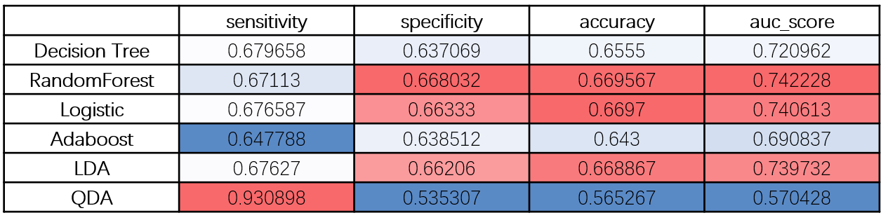
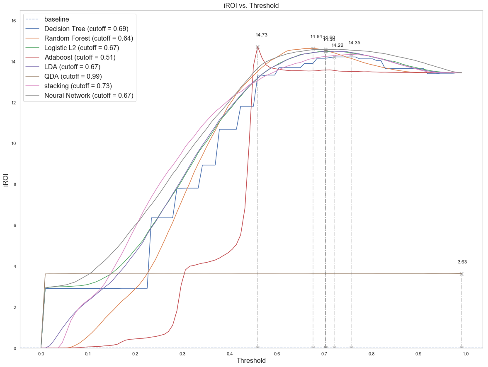
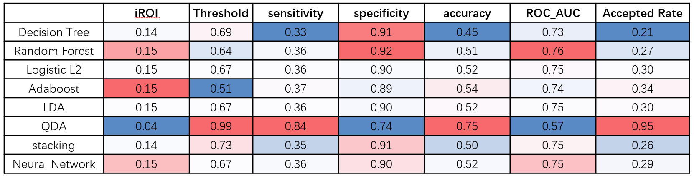

{:.no_toc}
*  
{: toc}

## Model to power investment strategy

In this project, we trained several models by grid search on a balanced sampling from 2016 accepted loans data.

The models are - 

- **Decision Tree** with `max_depth`=6

- **Random Forest** with `max_depth=10` and `n_estimators=100`

- **Logistic regression** with L2 regularization

- **Adaboost** with `estimator=DecisionTreeClassifier(max_depth = 6)`, `learning_rate=0.5` and `n_estimator=50`

- **LDA** with default setting

- **QDA** with default settings

- **Stacking** previous models

- **Neural Network** (settings decribed in “Model” section)

### Important Predictors

From the models above, we think tree-based models: decision tree, random forest, and AdaBoost, along with logistic regression is the most interpretable. Hence we compared weights or importance among each predictor to find out the most important ones.

We found some consensus important factors that can be grouped into subcategories - 

1)  The first is account information, including the number of accounts, delinquent history, mortgage info, and credit history. For instance - 

- **Percent of trades never delinquent (pct_tl_nvr_dlq)**: Delinquency refers to payments that were late (Payment History). Higher delinquency can result in lower credit score which can influence the probability of returning the loan (loan status).

- **Number of mortgage accounts (mort_acc)**: More mortgage accounts may indicating higher investment money. 

- **Months since oldest bank installment account opened (mo_sin_old_il_acct)**: Bank account duration can imply the borrowers’ investment or deposit strategy. People with longer account duration may have more saving than the rest, which means they have a higher chance to pay the money back. 

- **Average current balance (avg_cur_bal)**: average current balance can reflect the property (money) situation of the user. With more backup money, users can pay the bill with interest more easily. 

- **Charge Offs in last Year (chargeoff_within_12_mths)**: A charge-off is a declaration by a creditor that an amount of debt is unlikely to be collected. Users that have a higher charge-off number may have a lower probability to return the loan. 

- **The number of accounts on which the borrower is now delinquent (acc_now_delinq)**: may reflect the spending habit and credit status of the borrower.

2)  The first is income information, including the annual income, categorized employment length. These variables could indicate borrower’s ability to fulfill the loan.

### Predictive Quality

The models give the following ROC and performance metrics on test set.

However, a good performance on test set does not necessarily indicate good performance in ROI. 

ROI is calculated as the net return from investment over the amount of input. Since we are investing on the people who are predicted to fully return their loans, we will suffer from two kinds of mistakes - 

- A. We gave money to the wrong person who cannot pay back fully.

- B. We rejected decent people. Thus we lose part of the rates that we would have got if we had lent money to them.

Since the net return is calculated as total payment minus the funded amount, we could simply use the net return from the loans that we would fund (which loans that are predicted to pay back in full) minus the net return that we would have had if we would not reject (which loans that are not predicted to be full-paid.

As formally defined in “model” section, we used a modified version of ROI that takes “hidden loss” into consideration. We determined the threshold for each model to maximizing the combined net return.

For each model, we tested on each threshold to determine the one that will give the largest improved ROI.

### Expected Returns

Hence we defined the threshold from the critical point that will maximize iROI. The model performance measure is given as - 

Sensitivity is defined as the probability of identifying true fully-paid (or any form of delayed payments) from exact full paid. Specificity is defined as the probability of identifying true charge-offs (or any other forms of delays) from exact delays. We could see that all models except QDA tend to have high specificity but low sensitivity on real data, where the majority of the accepted loans are fully paid. Hence they tend to make conservative predictions that tend to be cautious about whether someone could payback. Perhaps due to the relatively conservative prediction strategy from our models, we confirmed that except QDA, each model could give over a 15% increase in return on investment. 

Comparing all the models above from both ROI perspective and prediction performance metrics, we conclude that Random Forest and Neural Network gives the optimal performance. We would like to recommend to investors to refer to these two model for wiser investments. 

## Ethical Implications of Model

Unfairness arises when demographic factors, conditioned on financial status or other sensible predictors, plays a role in determine how a loan request will be handled. In our dataset, we used addr_state to address this issue. 

When will lending club reject a borrower from a certain state? We propose that, the acceptance rate will be proportional to the rate of full-pay loans if the decision of the lending club is unbiased. To assess such assumption, we fit an linear regression model to see how each state deviates from the fitted line, which indicates potential discrimination.

To quantitatively assess the disparity, we are inspired by the definition of R squared, which is the R-squared = Explained variation / Total variation.

The R squared from this model, could be interpreted as - 
the percent variance in acceptance rate that could be explained by success rate (the rate that a loan will be fully paid)

If R squared is large, we could say that acceptance of a loan request is more unbiased. Otherwise, some groups may be privileged or underprivileged. 

However, lending club 2016 data suggests some states are off the line indicating there might be potential discrimination. For example, OR and ME have a relatively high return loan rate compare to CO and DC, but they also have a smaller accepting rate. On the other hand, some states, like NY and NJ, have relative small successful return loan rate but have accepting rate.

The second and third plots represent the relationship between predicted accept rate by our random forest and neural network models and the actual success rate. We can see that the dots are more centered towards the trend line, indicating that the accept rate depends more on the successfully paid rate. Also, the $R^2$ of these two linear models are higher than the original model, which suggests that using the acceptance rate predicted by our models, the linear regression model can explain more variability of the response data. Therefore, we can conclude that if adopting the investment strategy based on our random forest or neural network models, there would be less potential demographic discrimination.

Therefore, in our model, there still exist some bias. But compared to the 2016 history accepted loans in Lending club, the discrimination is mitigated a bit (R squared increased).

### Summary

In summary, according to the high-level project goal, 

- We have created several models to power our investment strategy, and give the cutoff for predicted probability of each model

- We have identified key consensus variables that are of high importance. Most of them fall in either personal empolyment information, or account/credit information.

- We devised improved version of ROI (iROI) that takes both exact and hidden return into account. We calculated expected ROI and found that our best model could increase ROI by 15%

- Predictive quality are measured on a set of performance metrics, on both entire 2016 data and test set.

- We built linear regression model to assess the acceptance disparity among borrowers from different states. The R squared metric is used to measure the percent variance in acceptance rate that could be explained by successfully paid-in-full rate. It seems that borrowers from southern state is more likely to be rejected. From R squared metric, our model still have some bias, but it is comparatively better than real 2016 data.

## Future work

- Study more about discrimination. Due to the limitation of this dataset, discrimination was reported in State level. However, we can joint the other dataset that contains more information about local ethnic, religions, etc by Zip Code. Discrimination can achieve a deeper level with more information. 

- Use all dataset contained in the Lending Club to build the models. Due to the limitation of our PCs, only 2016 year data was used. Models trained on larger dataset may become more generalized. 

- Use Google Refine to clean the user input data, `Job title` and `title`. It could cluster keywords in job description, allowing us to create categorical job feature that may help indicate the financial status of a borrower. 
