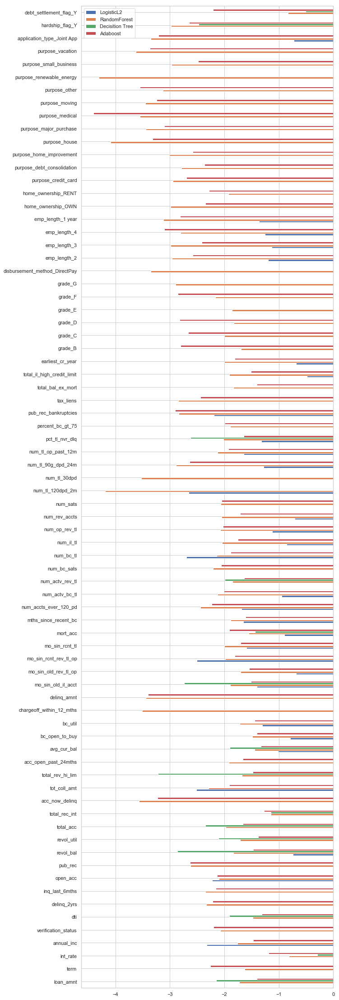
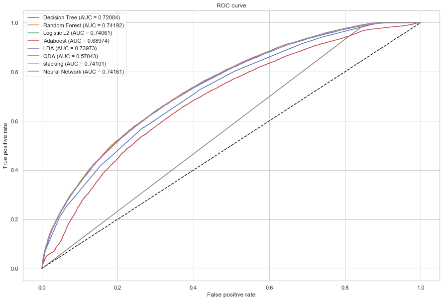
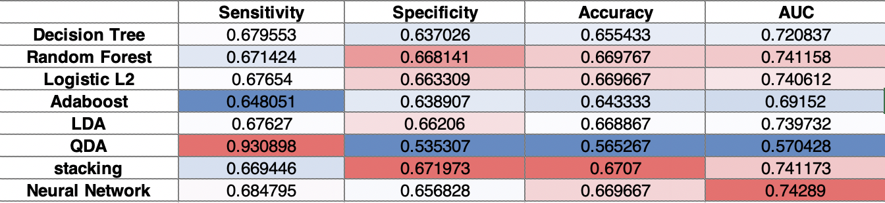
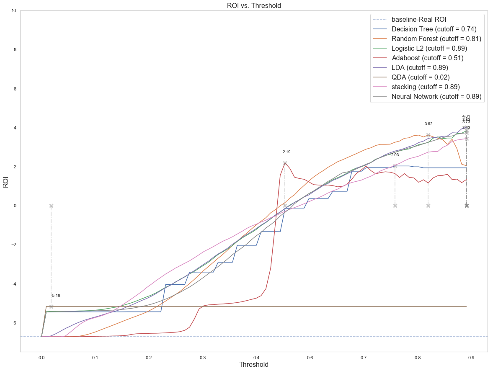
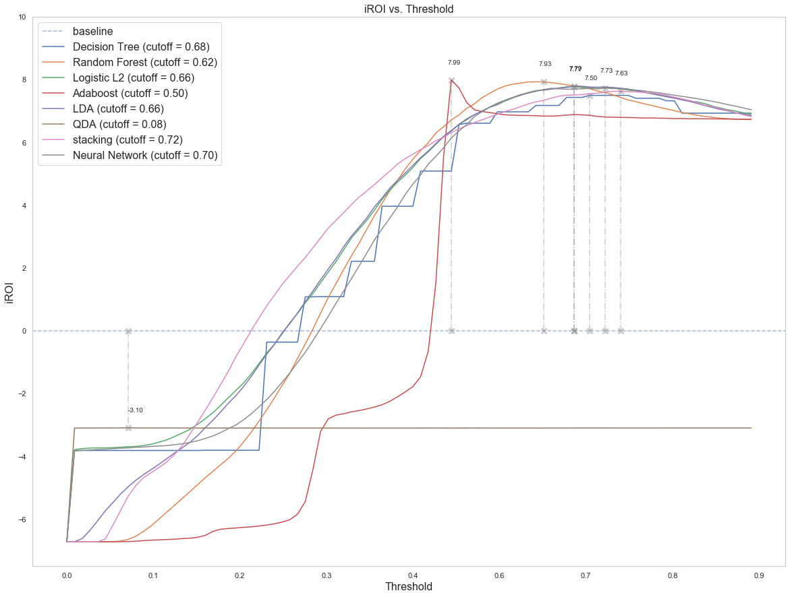
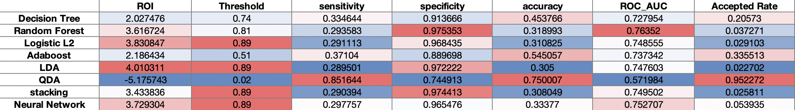
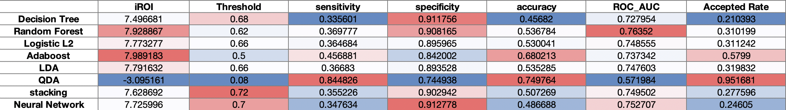
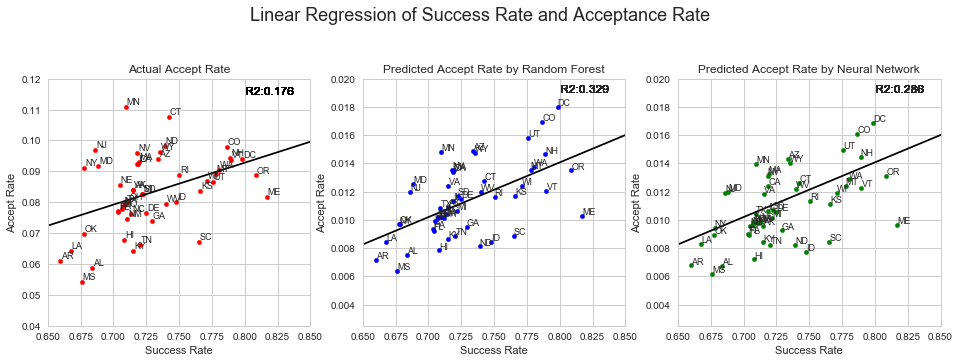

{:.no_toc}
*  
{: toc}

## Model to power investment strategy

In this project, we trained several models by grid search on a balanced sampling from 2016 accepted loans data.

The models are - 

- **Decision Tree** with `max_depth`=6

- **Random Forest** with `max_depth=10` and `n_estimators=100`

- **Logistic regression** with L2 regularization

- **Adaboost** with `estimator=DecisionTreeClassifier(max_depth = 6)`, `learning_rate=0.5` and `n_estimator=50`

- **LDA** with default setting

- **QDA** with default settings

- **Stacking** previous models

- **Neural Network** (settings decribed in “Model” section)

### Important Predictors

From the models above, we think tree-based models (decision tree, random forest, and AdaBoost), along with logistic regression is the most interpretable. Hence we compared weights or importance among each predictor to find out the most important ones.

Figure-1. Feature weights or importances

We found some consensus important factors that can be grouped into subcategories - 

1)  The first is account information, including the number of accounts, delinquent history, mortgage info, and credit history. For instance - 

- **Percent of trades never delinquent (pct_tl_nvr_dlq)**: Delinquency refers to payments that were late (Payment History). Higher delinquency can result in lower credit score which can influence the probability of returning the loan (loan status).

- **Number of mortgage accounts (mort_acc)**: More mortgage accounts may indicating higher investment money. 

- **Months since oldest bank installment account opened (mo_sin_old_il_acct)**: Bank account duration can imply the borrowers’ investment or deposit strategy. People with longer account duration may have more saving than the rest, which means they have a higher chance to pay the money back. 

- **Average current balance (avg_cur_bal)**: average current balance can reflect the property (money) situation of the user. With more backup money, users can pay the bill with interest more easily. 

- **Charge Offs in last Year (chargeoff_within_12_mths)**: A charge-off is a declaration by a creditor that an amount of debt is unlikely to be collected. Users that have a higher charge-off number may have a lower probability to return the loan. 

- **The number of accounts on which the borrower is now delinquent (acc_now_delinq)**: may reflect the spending habit and credit status of the borrower.

2)  The first is income information, including the annual income, categorized employment length. These variables could indicate borrower’s ability to fulfill the loan.

### Predictive Quality

We used grid search to optimise hyper-parameters for each model. The models give the following ROC and performance metrics on test set.

Figure-2. ROC curves for each model

Table-1. Performance metrics

It seems Random Forest and Neural Network gives best performances, in terms of specificity and AUC. 

### Expected Returns

A good performance on test set does not necessarily indicate good performance in Return On Investiment (ROI). Given our optimised models, we want to determine the optimal cutoff in predicted probability that will maximize ROI.

ROI is calculated as the net return from investment over the amount of input. 

A naive way of formalising it would be to divide net gain by investiment amount. In this approach we only consider the return on investiment rate from the loans that were invested.

Hence we determined the threshold for each model that will maximize naive ROI.

Figure-3. Naive ROI vs probability cutoff

Indeed, given fixed amount of money to invest, we could get the maximum ROI from those indicated cutoffs. However in reality this approach seems problematic, since it seems that we need to reject most of the loans in order to get the best ROI. For a investor that is financially capable to take on more risk, this approach limits their loan choices exclusively to those "safe" deals, but not the others that might be more profitable but more risky. Moreover, in reality each investor could invest different amount of notes into each posted loans so that they are allowed to split the risk. Therefore, the actual capacity for each investor to take on risks in perhaps more than we currently expect.

How do we find the optimal cutoff that could be less conservative while still maintaining substantial ROI? From this point we came up with another metric - improved ROI (iROI) by incorporating additional hidden loss.

Since we are investing on the people who are predicted to fully return their loans, there are two types of returns that we intend to maximize - 

- A. the return from our invested loans

- B. the loss from our uninvestied loans, if we would also invested them

The nominator of iROI (net return) is calculated as the amount of return from which we invested, minus the amount of return we would have get, if we had invested on those loans that we actually did not invest. Similarly, we determined the threshold for each model to maximizing the combined net return.

For each model, we tested on each threshold to determine the one that will give the largest iROI.

Figure-4. Determine cutoff for best iROI

Table-2. Naive ROI-based cutoff

Table-3 Improved ROI-based cutoff

We chose the metrics above to assess performance of each model.

Sensitivity is defined as the probability of identifying true fully-paid (or any form of delayed payments) from exact full paid. It indicates the probability of identifying decent loan requests.

Specificity is defined as the probability of identifying true charge-offs (or any other forms of delays) from exact delays. Higher specificity means better ability to identify the risky loans, but at the same time it increases with conservativeness.

Here we could see clearly, threshold optimized via ROI is more conservative than those from iROI. For each tables, we could see that all models except QDA tend to have high specificity but low sensitivity on real data, where the majority of the accepted loans are fully paid. 

How we would use our model to recommend investiments? We would use the ROI-based model to give investiment suggestions to those conservative players - who think more about safety rather than profits. On the contrary, we would use the iROI-based model to guide profit-driven investors - who are willing to take the risk for high returns.

## Ethical Implications of Model

Unfairness arises when demographic factors, conditioned on financial status or other sensible predictors, plays a role in determine how a loan request will be handled. In our dataset, we used addr_state to address this issue. 

When will lending club reject a borrower from a certain state? We propose that, the acceptance rate will be proportional to the rate of full-pay loans if the decision of the lending club is unbiased. To assess such assumption, we fit an linear regression model to see how each state deviates from the fitted line, which indicates potential discrimination.

To quantitatively assess the disparity, we are inspired by the definition of R squared, which is the R-squared = Explained variation / Total variation.

The R squared from this model, could be interpreted as - 
the percent variance in acceptance rate that could be explained by success rate (the rate that a loan will be fully paid)

If R squared is large, we could say that acceptance of a loan request is more unbiased. Otherwise, some groups may be privileged or underprivileged. 

However, lending club 2016 data suggests some states are off the line indicating there might be potential discrimination. For example, OR and ME have a relatively high return loan rate compare to CO and DC, but they also have a smaller accepting rate. On the other hand, some states, like NY and NJ, have relative small successful return loan rate but have accepting rate.

The second and third plots represent the relationship between predicted accept rate by our random forest and neural network models and the actual success rate. We can see that the dots are more centered towards the trend line, indicating that the accept rate depends more on the successfully paid rate. Also, the $R^2$ of these two linear models are higher than the original model, which suggests that using the acceptance rate predicted by our models, the linear regression model can explain more variability of the response data. Therefore, we can conclude that if adopting the investment strategy based on our random forest or neural network models, there would be less potential demographic discrimination.

Therefore, in our model, there still exist some bias. But compared to the 2016 history accepted loans in Lending club, the discrimination is mitigated a bit (R squared increased).

### Summary

In summary, according to the high-level project goal, 

- We have created several models to power our investment strategy, and give the cutoff for predicted probability of each model

- We have identified key consensus variables that are of high importance. Most of them fall in either personal empolyment information, or account/credit information.

- We devised improved version of ROI (iROI) that takes both exact and hidden return into account. We calculated expected ROI and found that our best model could increase ROI by 15%

- Predictive quality are measured on a set of performance metrics, on both entire 2016 data and test set.

- We built linear regression model to assess the acceptance disparity among borrowers from different states. The R squared metric is used to measure the percent variance in acceptance rate that could be explained by successfully paid-in-full rate. It seems that borrowers from southern state is more likely to be rejected. From R squared metric, our model still have some bias, but it is comparatively better than real 2016 data.

## Future work

- Study more about discrimination. Due to the limitation of this dataset, discrimination was reported in State level. However, we can joint the other dataset that contains more information about local ethnic, religions, etc by Zip Code. Discrimination can achieve a deeper level with more information. 

- Use all dataset contained in the Lending Club to build the models. Due to the limitation of our PCs, only 2016 year data was used. Models trained on larger dataset may become more generalized. 

- Use Google Refine to clean the user input data, `Job title` and `title`. It could cluster keywords in job description, allowing us to create categorical job feature that may help indicate the financial status of a borrower. 
