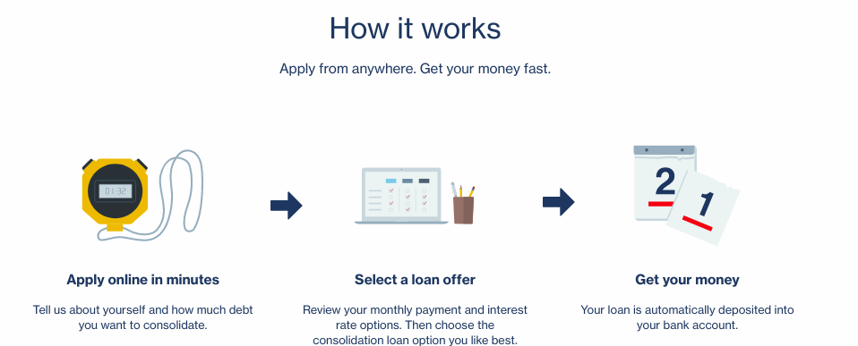

Group 37: Qing Zhang, Xiyu Ding, Jingyi Chen, Jiaxuan Zhao

{:.no_toc}
*  
{: toc}

## Background  

Lending Club is the lending network to register with the Securities and Exchange Commission (SEC). It's mission is to transform the banking system to make credit more affordable and investing more rewarding [1]. The Lending Club platform connects borrowers to investors and facilitates the payment of loans up to \$40,000 [2]. The basic idea is that borrowers apply for a loan on the Lending Club Marketplace. Investors can review the loan applications, along with risk analysis provided by LendingClub, to determine how much of the loan request they are willing to fund. When the loan is funded, the borrower will receive the loan.

Based on the setting of this platform, investors can make wrong decisions in some situations (the borrower received the loan even they don't have ability to return the money). In this case, we want to provide a better model that can predict the probability of fully return.    

Moreover, similar to other loan and investment platforms, Lending Club claims it is an "Equal Housing Lender" which means "the bank makes loans without regard to race, color, religion, national origin, sex, handicap, or familial status." [4] With this in mind, analyzing discrimination cross states is also necessary.

## Project Statement  

### Mission

1. To find the optimal model-based investiment strategy and sigificant factors leveraging our strategy

2. In terms of ethical implications, we assessed whether this potential difference in acceptance rates across regions could be fully explained by the successful return rate from Lending Club records.

### Goal

- Predict the probability that a loan will be fully returned plus interest rate by the end of the due date when the loan just be proved by lending company

- Use the probilities from (1) to calculate Return on Investment (ROI), where ROI is a performance measure used to evaluate the efficiency of an investment or compare the efficiency of a number of different investments. ROI tries to directly measure the amount of return on a particular investment, relative to the investment’s cost.

- Compare predicted ROI with true ROI to see the benefit of our model (profit)

- use rejected loan data and accepted loan data to find discrimination among states

## Data Sourcing

The data in this project came from 2016 Lending Club web as row represents each loan and column represents features of each loan. We decided to use this dataset since we believed most of the borrowers can return the full loan within two years (2018), and the most recent data set should give us a better model that can reflecte the LendingClub’s current lending loan.

In accepted datasets, they contain information about the loans as well as personal description. For example, loan information contains loan amount, funded amount, interest rate, etc. Personal information contains employ title, length, annual income, purpose, state, etc. The other one is the rejected datasets. Since they only contain a few variables, we will not use it to fit the model. They can be used to explore discrimination.

## Literature Review

- We refered [this project](https://rstudio-pubs-static.s3.amazonaws.com/115829_32417d32dbce41eab3eeaf608a0eef9d.html) for basic intuition for EDA.

- We refered to methodologies from stanford project: http://cs229.stanford.edu/proj2015/199_report.pdf in which they tried to predict the loan status from financial information. They used TF-IDF for text processing.

- We learned the [defination of discrmination](https://web.archive.org/web/20180415190505/https://www.chrc-ccdp.gc.ca/eng/content/what-discrimination-1). From guest lecture and the [financial times post](https://ftalphaville.ft.com/2016/01/13/2150093/lenders-cant-discriminate-but-what-about-investors/) we realized that race and ethinical information could be inferred from zip-codes and address state. Therefore although those info is not explicitly included, discrmination may still arise.

- During the model building process, we designed our neural network based on some literature, with respect to optimiser selection, link function.. etc.- For details, please refer to our [NN section](https://hurrialice.github.io/cs109/Models.html#neural-network)

- For website, we forked [gpages](https://github.com/rahuldave/gpages) and added our own notebooks.

## Reference 

[1] Lending Club  
https://www.lendingclub.com/  

[2] Lending Club Personal Loan  
https://www.lendingclub.com/loans/personal-loans    

[3] FDIC Equal Housing Lender  
https://www.fdic.gov/regulations/laws/rules/2000-6000.html

